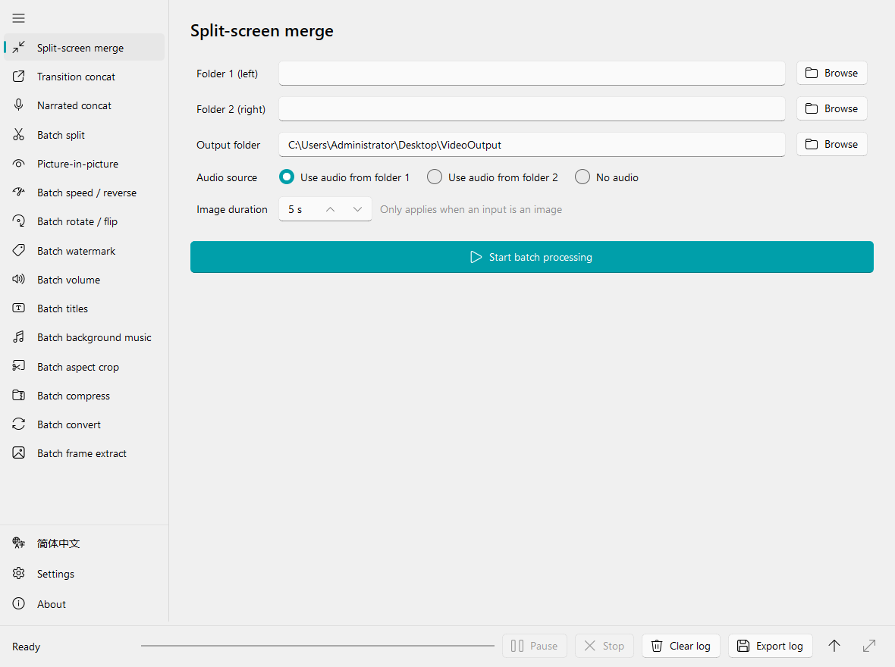
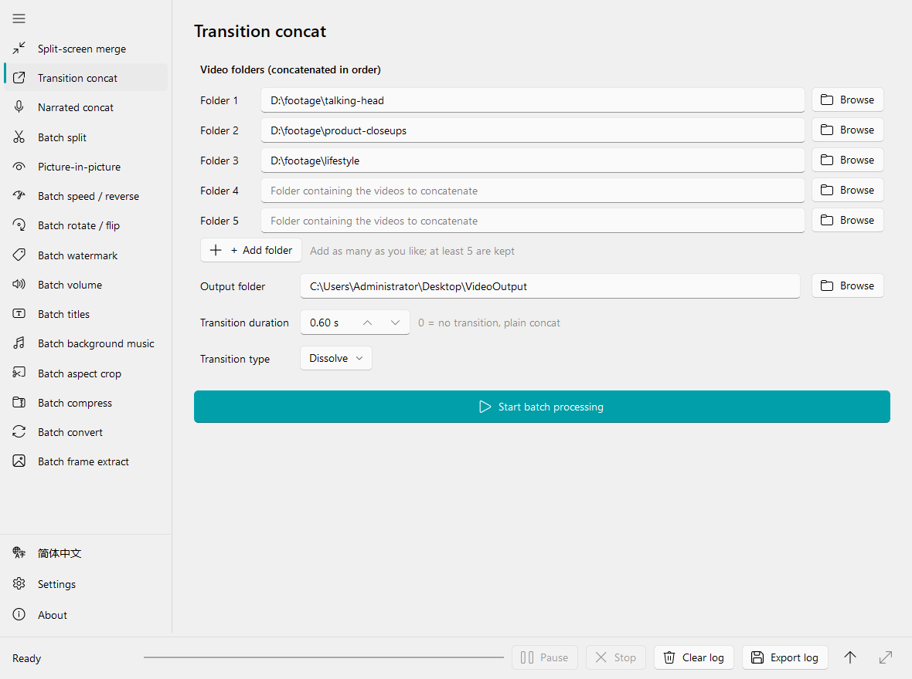
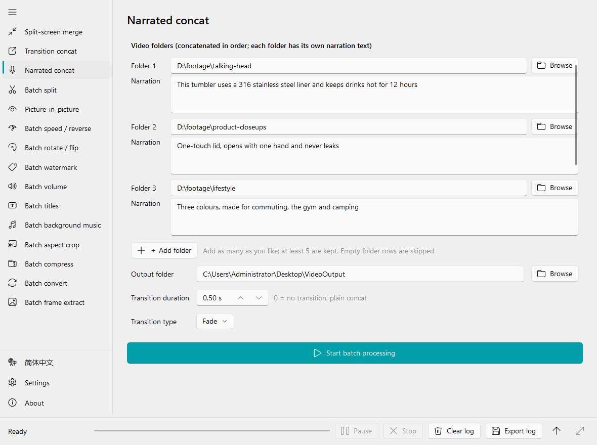
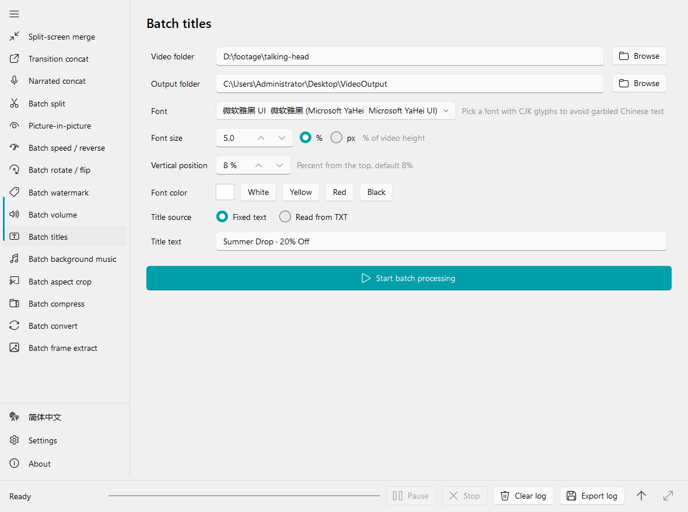
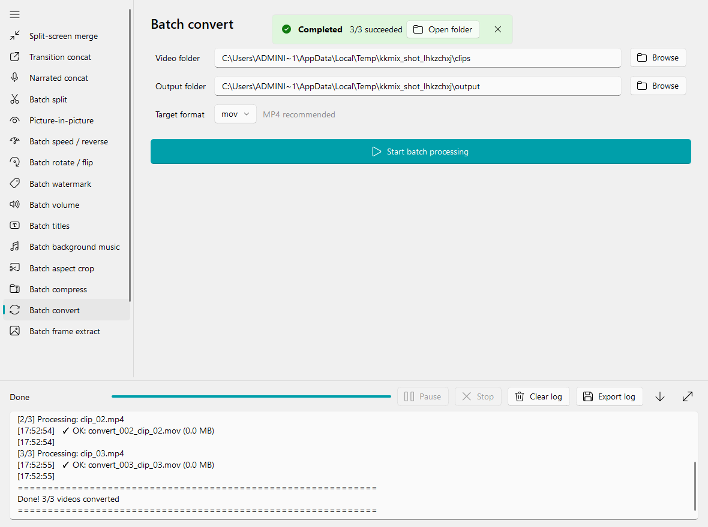
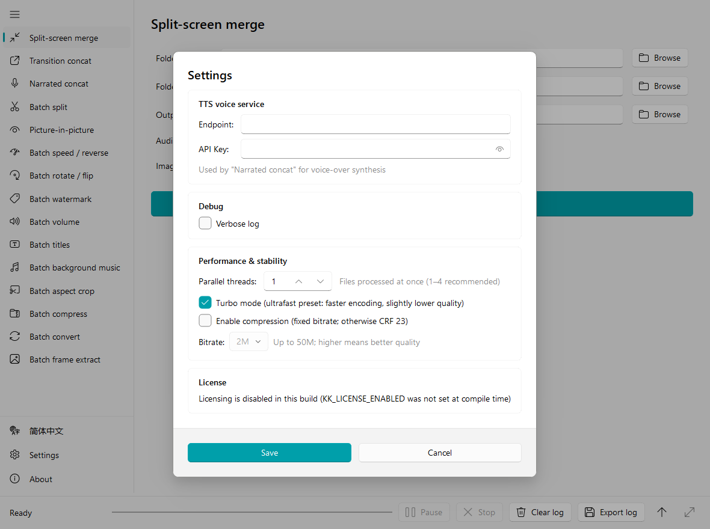

# kk-mix

**English** | [简体中文](README.zh-CN.md)

Batch video editing for Windows, driven by folders instead of timelines. Point it at a folder (or several), pick an operation, and it writes a folder of finished videos — 15 operations, all powered by FFmpeg, wrapped in a PySide6 Fluent UI.




## Why kk-mix

Timeline editors are built for one video at a time. kk-mix is built for the other situation: fifty clips that all need the same treatment, or five folders of footage that need to become twenty *different* videos. Every operation is a form, not a timeline — fill in the folders and parameters, press Start, watch the log.

- **Folder in, folder out.** Every operation reads a folder and writes a folder; files are processed in name order so outputs line up with inputs.
- **Pause / stop mid-batch**, a live log, and a one-click *Open folder* when it finishes.
- **No learning curve.** If you can pick a folder you can use it.
- **Bilingual UI** — English and Simplified Chinese, switched with one click.
- **Portable build** — package into a single folder with FFmpeg embedded; nothing to install.

## What people use it for

| Scenario | How kk-mix fits |
|---|---|
| **Short-video matrix / multi-account publishing** | Put hooks, product shots and outros in separate folders; *Transition concat* joins the *i*-th clip of each into one video — 5 folders × 20 clips = 20 distinct videos in a single run, no two alike. |
| **E-commerce product videos** | *Narrated concat* turns a script into a voice-over and cuts every clip to its narration length; then *Batch titles*, *Batch watermark* and *Aspect crop* to 9:16 for the platform. |
| **Course / livestream / podcast slicing** | *Batch split* cuts long recordings into fixed-length parts, optionally with an MP3 per part. |
| **Brand compliance at scale** | Stamp every file with a logo (*Watermark*), a headline from a TXT list (*Titles*), and a consistent loudness (*Volume*). |
| **Platform delivery & archiving** | *Aspect crop* to 9:16 / 16:9 / 1:1 / 4:5, *Compress* to a target bitrate in H.264 or H.265, *Convert* containers, *Extract frames* for thumbnails. |
| **Comparison & reaction formats** | *Split-screen merge* pairs two folders into 1080×1080 left/right videos; *Picture-in-picture* drops a webcam or product clip over the main footage. |

## Features

### Compose

#### Transition concat



Give it N folders (5 rows to start, add as many as you like). It sorts each folder, takes the *i*-th file from every folder and joins them in order — 3 folders of 20 clips give you 20 videos, each a different combination. Clips are normalized to the first clip's resolution and frame rate (crop-to-fill, never stretched), and a silent track is added to clips without audio so joins never fail. 20 `xfade` transitions (fade, wipe, slide, smooth, circle, radial, dissolve, pixelize…) with a matching `acrossfade` on the audio; a transition longer than the shortest clip is clamped automatically; set it to 0 for a hard cut.

#### Narrated concat



Transition concat with a script. Each folder gets a block of text, one line per video: line *k* is synthesized into speech for the *k*-th video (lines are reused cyclically if there are fewer lines than videos). Every clip is looped or trimmed to exactly its narration length, the original audio is dropped, narration plays back-to-back, and video transitions live in an extra tail so speech never overlaps. Speech comes from a self-hosted [Index-TTS](docs/index-tts-api.md) service cloning one reference voice, with a fixed seed so every clip sounds like the same speaker.

#### Split-screen merge

Pairs folder 1 and folder 2 in order and puts them side by side: each half is fitted into 540×1080 (letterboxed, never stretched) for a 1080×1080 output. Keep the audio from the left, the right, or neither; still images are held for a configurable number of seconds; the output is cut to the shorter of the two clips.

#### Picture-in-picture

Background folder + foreground folder, paired in order. The foreground is scaled to 10–100 % of the background and pinned to one of the four corners.

### Cut & adjust

| Feature | What it does |
|---|---|
| **Batch split** | Cut every video into fixed-length segments (1 s – 1 h). Optionally export an MP3 for each segment and keep the trailing remainder (if longer than 0.5 s). |
| **Batch speed / reverse** | 0.1×–5× with audio kept in sync; optional reverse. |
| **Batch rotate / flip** | 90° clockwise, 180°, 90° counter-clockwise, horizontal flip, vertical flip. |
| **Batch aspect crop** | Center-crop to 9:16, 16:9, 1:1, 4:3, 3:4, 4:5 or 21:9 — videos and images alike. |

### Brand & audio

#### Batch titles



Burn a headline into every video. Pick any installed font (CJK fonts are listed by their Chinese names), size it in pixels or as a % of video height, position it as a % from the top, choose a colour preset or open the picker. Text is auto-wrapped to the video width and drawn with an outline and drop shadow so it stays readable on any background. Use one fixed title, or point it at a TXT file and each video takes the next line (wrapping around when the list runs out).

| Feature | What it does |
|---|---|
| **Batch watermark** | Overlay a PNG/JPG/WebP at one of five positions, 5–100 % opacity, sized 2–50 % of the video width. |
| **Batch background music** | Pair each video with a track from a music folder (audio files, or videos whose audio gets extracted; the last track repeats if you run out). Replace the original audio or mix the two. |
| **Batch volume** | 0.1×–10× gain. |

### Deliver

| Feature | What it does |
|---|---|
| **Batch compress** | Target bitrate from 0.5M to 8M, H.264 or H.265. |
| **Batch convert** | Re-encode to mp4, avi, mov or mkv. |
| **Batch frame extract** | Save one JPG every *N* seconds (0.1–600) from every video. |

### Every operation gets



- **Pause / Stop** at any point — the current file finishes, the rest wait or are skipped.
- A **live log** (collapsible, maximizable, exportable) with a ✓/✗ per file and a final tally; turn on *Verbose log* in Settings to see every FFmpeg command line.
- An **Open folder** button on the completion toast.
- Global **turbo mode** (`ultrafast` preset) and **bitrate-or-CRF** control that apply to every encode.

## Worked example: 3 folders → 20 unique videos

1. Put 20 hook clips in `hooks\`, 20 product shots in `product\` and 20 outros in `outro\`.
2. Open **Transition concat**, point folders 1/2/3 at them, pick *Dissolve* at 0.5 s, press **Start**.
3. You get `concat_001.mp4` … `concat_020.mp4`, each one `hooks[i] + product[i] + outro[i]`.
4. Optional: run **Batch titles** on that output folder with a 20-line TXT so every video gets its own headline, then **Batch watermark**, then **Aspect crop** to 9:16.

Every step is folder → folder, so chaining operations is just pointing the next one at the previous output.

## Output naming

| Operation | Output file |
|---|---|
| Split-screen merge | `merge_001_<left>_<right>.mp4` |
| Transition concat | `concat_001.mp4` |
| Narrated concat | `sub_concat_001.mp4` |
| Batch split | `<name>_part001.mp4` (+ `<name>_part001.mp3`) |
| Picture-in-picture | `pip_001_<background>.mp4` |
| Speed / reverse | `speed_001_<1.5x or reverse>_<name>.mp4` |
| Rotate / flip | `rotate_001_<op>_<name>.mp4` |
| Watermark | `watermark_001_<name>.mp4` |
| Volume | `volume_001_<factor>x_<name>.mp4` |
| Titles | `title_001_<name>.mp4` — default folder `<source>\title_output` |
| Background music | `music_001_<name>.mp4` |
| Aspect crop | `crop_9x16_001_<name>.<ext>` — default folder `<source>\crop_output` |
| Compress | `compress_<bitrate>_001_<name>.mp4` |
| Convert | `convert_001_<name>.<ext>` |
| Frame extract | `<name>_0001.jpg`, `<name>_0002.jpg`, … |

The number is the file's position in the sorted source folder, so outputs line up with inputs. Unless noted, the default output folder is `Desktop\VideoOutput`.

## Quick Start (from source)

### Prerequisites

- Windows 10/11 x64
- Python ≥ 3.10 (developed on 3.14)
- [uv](https://docs.astral.sh/uv/) for dependency management (`pip install uv`, or the official installer)
- `ffmpeg.exe` / `ffprobe.exe` — **not bundled with this repo**, see step 2

### Steps

#### 1. Clone and install dependencies

```bash
git clone https://github.com/jaikydota/kk-mix.git
cd kk-mix
uv sync
```

`uv sync` creates `.venv`, downloads a suitable Python if needed, and installs every dependency.

#### 2. Get FFmpeg (the only manual step)

All video processing is done by shelling out to `ffmpeg.exe` / `ffprobe.exe`. These are **not distributed with the repo** (they are large and separately licensed), so download an official **prebuilt Windows binary** — **no compiling required**.

| Source | Link | Which file |
|---|---|---|
| BtbN/FFmpeg-Builds (GitHub) | https://github.com/BtbN/FFmpeg-Builds/releases | `ffmpeg-master-latest-win64-gpl.zip` |
| gyan.dev | https://www.gyan.dev/ffmpeg/builds/ | `ffmpeg-release-full.7z` |

Unzip it, open the `bin` folder inside, and copy **both `ffmpeg.exe` and `ffprobe.exe`** into the project root:

```
kk-mix/
├── ffmpeg.exe      ← here
├── ffprobe.exe     ← here
├── kk_qt.py
├── pyproject.toml
└── qt/
```

Both filenames are already in `.gitignore`, so they will never be committed by accident.

> **You need both.** With `ffmpeg.exe` alone, duration and resolution probing fails and features like transition concat will not work.
>
> Alternatively, add the extracted `bin` folder to your system `PATH`. When running from source the actual lookup order is:
> **system `PATH` → `C:\ffmpeg\bin` → `C:\Program Files\ffmpeg\bin` → `D:\ffmpeg\bin` → project root**.
> Note that the project root is the *last* fallback — if another FFmpeg is already on your `PATH`, that one wins.

#### 3. Run

```bash
uv run python kk_qt.py        # or double-click start.cmd
```

Licensing is **off by default**, so the app starts straight up with no license key needed. See [Licensing](#licensing-system-and-build-secrets-read-before-releasing) if you want to enable it for a release.

> The app still launches without FFmpeg, but a persistent red "FFmpeg not found" banner appears and no processing feature will run.

### Language

The UI is available in **English** and **Simplified Chinese**, defaulting to **Simplified Chinese**. Click **简体中文 / English** at the bottom of the left navigation bar to switch at any time — the window is rebuilt instantly and the log is preserved. The choice is saved as `language` in `settings.json`.

### Configuration



Global settings live in `settings.json` next to the program (editable in-app via **Global Settings**). A template is provided:

```bash
cp settings.example.json settings.json
```

| Field | Meaning |
|---|---|
| `language` | UI language: `"zh"` (default), `"en"`, or `"auto"` to follow the system locale |
| `tts_base_url` / `tts_api_key` | Index-TTS endpoint and api-key; only needed by *Narrated concat* |
| `verbose_log` | Print the full ffmpeg command line and stderr |
| `speed_priority` | `true` uses the `ultrafast` preset, `false` uses `medium` |
| `compress_video` / `bitrate` | When enabled, encodes with `-b:v <bitrate>`; otherwise `-crf 23` |

The file is optional — without it the app falls back to these defaults.

### Narrated concat (TTS)

This feature needs a self-hosted Index-TTS service; the expected API is documented in [docs/index-tts-api.md](docs/index-tts-api.md). In addition:

1. Put the voice-cloning reference audio at `assets/tts_reference.wav` (gitignored, never committed);
2. Fill in the endpoint and api-key under **Global Settings**;
3. On first run the reference clip is uploaded to the server automatically.

Every other feature works without any of this.

## Building a Release

The build output is `dist/kk_qt/` — a self-contained folder (FFmpeg and the license `.pyd` embedded) that can be zipped and handed to end users.

### Extra requirements

- **Visual Studio Build Tools** with the "Desktop development with C++" workload — MSVC is required to Cython-compile the license module
- `uv sync` already installs the dev dependencies (Cython, PyInstaller)

### One-click build

```bat
build_qt.cmd
```

This runs: `setup_cython.py` compiles `_license_core.pyx` → PyInstaller packages the main app → PyInstaller packages `keygen.exe` → everything is zipped to `dist/kk_qt_<timestamp>.zip`.

Step by step instead:

```bash
uv run python setup_cython.py build_ext --inplace   # produces _license_core.cp3xx-win_amd64.pyd
uv run pyinstaller kk_qt.spec --clean --noconfirm   # produces dist/kk_qt/
```

### Licensing system and build secrets (read before releasing)

Licensing is **disabled by default** — clone, run, and everything works with no license key. It only turns on if you explicitly build with `KK_LICENSE_ENABLED=1`.

When enabled, the app uses a per-machine scheme: the machine ID is an MD5 of the motherboard UUID plus CPU ID; a license key is an AES-CBC encrypted JSON blob (expiry date, bound machine ID); `keygen.exe` mints the keys. The logic lives in `_license_core.pyx` and is compiled to a `.pyd` to raise the bar for reverse engineering.

The on/off switch is **burned into the `.pyd` at compile time**, not read from `settings.json` or an environment variable — anything readable at runtime could simply be flipped off by an end user, which would defeat the purpose. So turning it off costs nothing in security when it is on.

**No real secret is stored in this repo.** The encryption seed in the `.pyx` is a placeholder, injected at compile time by `setup_cython.py`:

```bash
cp build_secrets.env.example build_secrets.env   # gitignored
# edit build_secrets.env:
#   KK_LICENSE_ENABLED=1                  # omit or set 0 to ship without licensing
#   KK_LICENSE_SEED=<a long random string>
build_qt.cmd
```

`setup_cython.py` prints the resulting state on every build, e.g. `授权校验：启用（KK_LICENSE_ENABLED=1），种子：自定义`.

Environment variables of the same names also work and take priority. If the seed is not provided, the development default `kk-mix-dev` is used — **fine for local testing, never for a real release**. Changing the seed invalidates every previously issued license key.

`keygen.exe` has no access gate of its own, so **never ship it alongside the app** — anyone holding it can mint license keys for your build.

If you do not want licensing at all, just delete the `check_license()` call in `kk_qt.py`; nothing else depends on the `.pyd`.

## Project Layout

```
kk-mix/
├── kk_qt.py                 # Entry point: QApplication → license check → MainWindow
├── kk_qt.spec               # PyInstaller config (UPX exclusions, module excludes)
├── build_qt.cmd             # One-click build script
├── setup_cython.py          # Cython build + build-secret injection
├── _license_core.pyx        # Licensing core (placeholders replaced at compile time)
├── keygen.py                # License key generator (Tkinter, packaged separately)
├── settings.example.json    # Config template
├── build_secrets.env.example
├── assets/                  # Logo; place tts_reference.wav here yourself
├── docs/
│   ├── index-tts-api.md     # TTS service API contract
│   └── screenshots/         # README images, regenerated by tools/make_screenshots.py
└── qt/
    ├── main_window.py       # Navigation + page stack + log/progress/pause-stop panel
    ├── settings_window.py   # Global settings dialog
    ├── core/
    │   ├── batch_worker.py  # BatchWorker(QThread) base, pause/stop control, unified run_cmd
    │   ├── ffmpeg_helper.py # FFmpeg/ffprobe discovery, media probing, encoder args
    │   ├── app_settings.py  # AppSettings dataclass + JSON persistence
    │   ├── paths.py         # Version, extension sets, resource paths
    │   ├── fonts.py         # System font enumeration, title auto-wrap
    │   ├── tts_client.py    # Index-TTS client
    │   ├── i18n.py          # tr() + language switching
    │   ├── translations_en.py # English strings (keyed by the Chinese source text)
    │   └── license.py       # License dialog
    ├── tabs/                # One file per feature, all subclassing BaseTab
    └── tools/
        ├── check_i18n.py    # i18n coverage check
        └── make_screenshots.py  # regenerates docs/screenshots (both languages)
```

### Adding a feature page

1. Create `qt/tabs/<name>.py`:
   - `class <Name>Worker(BatchWorker)` — implement `run_batch() -> (success, summary)`, call `self.ctrl.wait_if_paused()` inside the loop, run FFmpeg via `self.run_cmd(cmd)`, and set `self.output_dir`.
   - `class <Name>Tab(BaseTab)` — define `NAME / TITLE / ICON`, implement `build_form()` (add widgets to `self.form_layout`) and `build_worker()` (validate input, return the worker).
2. Append `<Name>Tab(self)` to the list in `_register_tabs()` in `qt/main_window.py`.
3. Write every user-visible string as `tr("中文")` (Chinese is the source language; use `tr("…{0}…").format(x)` instead of f-strings), add the English text to `qt/core/translations_en.py`, and run `uv run python tools/check_i18n.py` — it fails on any unwrapped or untranslated string.

More conventions in [AGENTS.md](AGENTS.md).

## FAQ

**"FFmpeg not found" on startup** — Make sure *both* `ffmpeg.exe` and `ffprobe.exe` are in place; see "Get FFmpeg" above. Packaged builds embed them automatically.

**Packaged build crashes immediately** — Usually UPX compressing a Qt DLL. `kk_qt.spec` already whitelists `Qt6*.dll` and the VC runtime under `upx_exclude`; add any new DLL there, or disable UPX entirely.

**`setup_cython.py` cannot find `cl.exe`** — MSVC Build Tools are not installed, or you need to run it from the "x64 Native Tools Command Prompt".

**`keygen.py` reports a missing `_license_core`** — The repo only ships the source `_license_core.pyx`. Build it first with `uv run python setup_cython.py build_ext --inplace`; the resulting `.pyd` is gitignored, so it must be rebuilt after a fresh clone (and after anything that cleans the project root).

**"Font failed to load" when adding titles** — The selected font is not a TTF/OTF/TTC, or its path contains special characters; pick another system font.

**Narrated concat returns 401 / missing reference audio** — Check the api-key in `settings.json`, and make sure `assets/tts_reference.wav` exists (it is uploaded on first run).

## Contributing

Issues and pull requests are welcome. Before submitting, make sure `uv run python kk_qt.py` still launches and that any new feature page follows the conventions above.

When editing the README, please update both [README.md](README.md) (English) and [README.zh-CN.md](README.zh-CN.md) (Chinese). After a UI change, regenerate the screenshots with `uv run python tools/make_screenshots.py` (needs FFmpeg for the "batch finished" shot).

## License

[MIT](LICENSE) © 2026 jaikydota

This project builds on [FFmpeg](https://ffmpeg.org/) (LGPL/GPL, downloaded separately by the user), [PySide6](https://doc.qt.io/qtforpython/) (LGPL) and [PySide6-Fluent-Widgets](https://github.com/zhiyiYo/PyQt-Fluent-Widgets) (GPLv3 — review its terms for commercial use).
