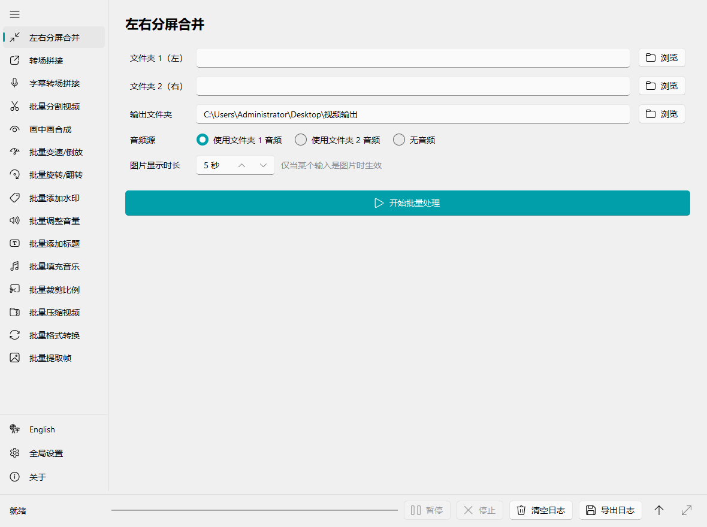
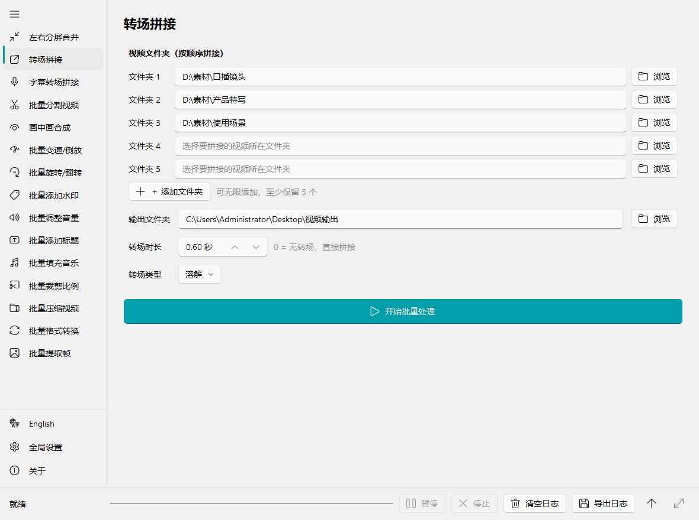
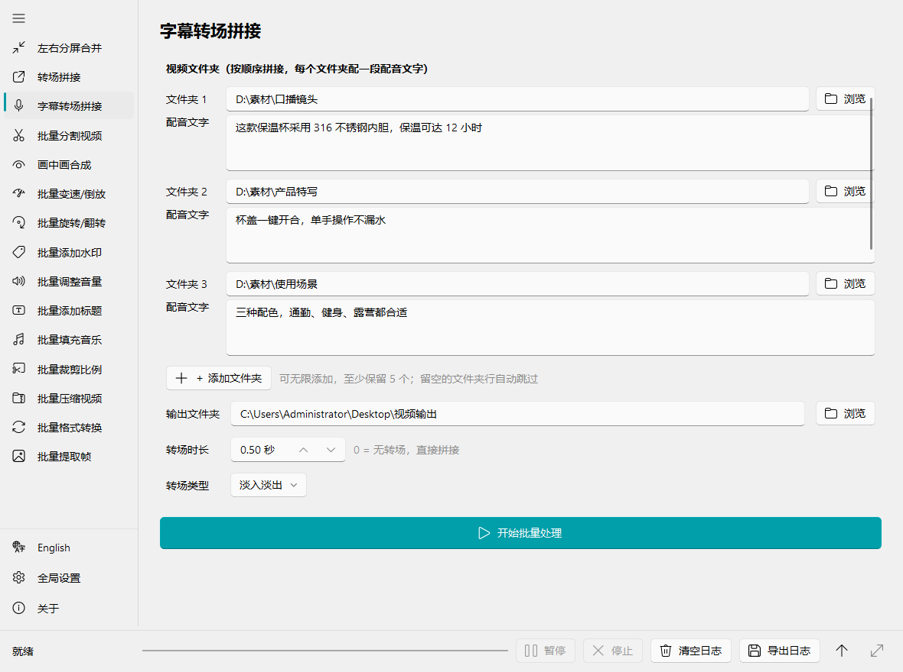
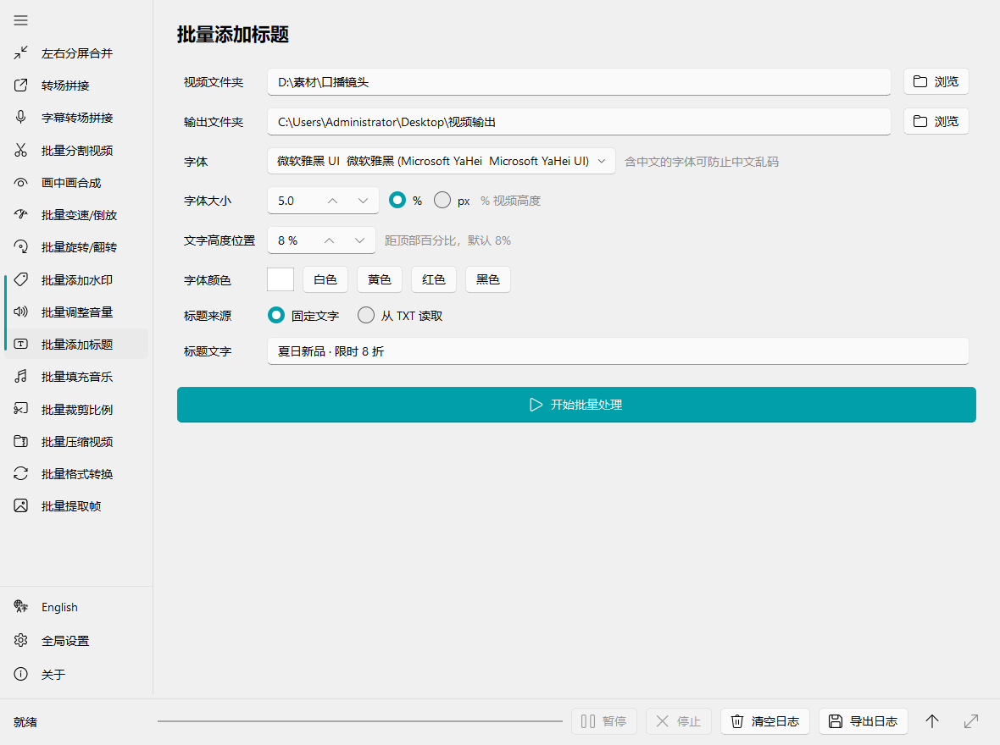
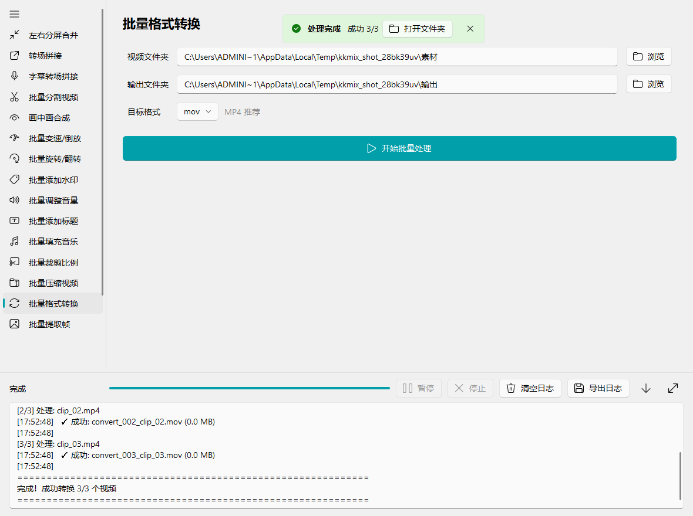
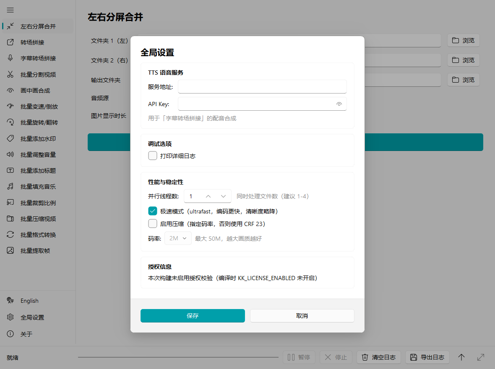

# kk-mix

[English](README.md) | **简体中文**

面向 Windows 的批量视频混剪工具——以文件夹为单位，而不是时间线。选一个（或几个）文件夹，挑一个操作，它就输出一个装满成片的文件夹。15 项批处理能力，全部由 FFmpeg 驱动，PySide6 Fluent 界面。




## 为什么做 kk-mix

时间线剪辑软件是为"一次剪一条"设计的。kk-mix 面对的是另一种场景：五十条素材要做同样的处理，或者五个文件夹的素材要组合出二十条**互不相同**的视频。这里每个功能都是一张表单，不是一条时间线——填好文件夹和参数，点开始，看日志。

- **文件夹进、文件夹出。** 每个功能都读一个文件夹、写一个文件夹；按文件名顺序处理，输出与输入一一对应。
- **批处理中途可暂停 / 停止**，实时日志，完成后一键打开输出目录。
- **零学习成本。** 会选文件夹就会用。
- **中英双语界面**，一键切换。
- **绿色便携版**：打包成一个文件夹，内嵌 FFmpeg，免安装。

## 适用场景

| 场景 | kk-mix 怎么用 |
|---|---|
| **短视频矩阵 / 多账号批量起号** | 把开头钩子、产品镜头、结尾引导分别放进三个文件夹；*转场拼接*取每个文件夹的第 *i* 条拼成一条——5 个文件夹 × 20 条素材 = 一次跑出 20 条各不相同的视频。 |
| **电商带货 / 产品视频** | *字幕转场拼接*把文案合成为配音，并把每段素材裁到与配音等长；再用*批量添加标题*、*批量添加水印*、*裁剪比例*到 9:16 适配平台。 |
| **课程 / 直播回放 / 播客切片** | *批量分割*把长录像切成固定时长的片段，可顺带导出每段的 MP3。 |
| **品牌规范批量落地** | 每条视频打上 Logo（*水印*）、从 TXT 逐行分配标题（*标题*）、统一响度（*音量*）。 |
| **多平台分发与归档** | *裁剪比例*到 9:16 / 16:9 / 1:1 / 4:5，*压缩*到目标码率（H.264 或 H.265），*格式转换*，*提取帧*做封面。 |
| **对比 / 反应类格式** | *左右分屏合并*把两个文件夹配成 1080×1080 的左右分屏；*画中画*把口播或产品小窗叠在主画面上。 |

## 功能详解

### 组合

#### 转场拼接



给它 N 个文件夹（默认 5 行，可无限添加）。它对每个文件夹排序，取每个文件夹的第 *i* 个文件按顺序拼接——3 个文件夹各 20 条素材，就得到 20 条组合各不相同的视频。素材自动统一到第一段的分辨率和帧率（裁剪填充，绝不拉伸），没有音轨的素材会补静音轨，拼接不会因此失败。20 种 `xfade` 转场（淡入淡出、擦除、滑动、平滑、圆形、径向、溶解、像素化……）并配合音频 `acrossfade`；转场时长超过最短片段时自动钳制；设为 0 则硬切。

#### 字幕转场拼接



带文案的转场拼接。每个文件夹配一段文字，一行对应一条视频：第 *k* 行合成为第 *k* 条视频的配音（行数少于视频数时循环使用）。每段素材循环或裁剪到与配音**精确等长**，原声丢弃，配音首尾直连，转场画面放在额外延长的尾部，语音永远不会互相覆盖。配音来自自建的 [Index-TTS](docs/index-tts-api.md) 服务，克隆同一段参考音、固定 seed，整批听起来是同一个人。

#### 左右分屏合并

把文件夹 1 和文件夹 2 按顺序配对、左右并排：每边等比缩放进 540×1080（留黑边，绝不拉伸），输出 1080×1080。音频可选左、右或无；静态图片按设定秒数停留；输出时长取两段中较短者。

#### 画中画合成

背景文件夹 + 前景文件夹按顺序配对。前景缩放到背景的 10%–100%，固定在四角之一。

### 剪切与调整

| 功能 | 说明 |
|---|---|
| **批量分割视频** | 把每条视频切成固定时长的片段（1 秒–1 小时）。可选为每段导出 MP3，可选保留末尾不足一段的余数（大于 0.5 秒时）。 |
| **批量变速 / 倒放** | 0.1×–5×，音频同步；可倒放。 |
| **批量旋转 / 翻转** | 顺时针 90°、180°、逆时针 90°、水平翻转、垂直翻转。 |
| **批量裁剪比例** | 居中裁剪到 9:16、16:9、1:1、4:3、3:4、4:5 或 21:9——视频和图片都支持。 |

### 品牌与音频

#### 批量添加标题



把标题烧进每条视频。任选已安装字体（中文字体按中文名列出），字号按像素或视频高度百分比，位置按距顶部百分比，颜色有预设也可自选。文字按视频宽度自动换行，带描边和投影，任何背景都清晰。可以用一个固定标题，也可以指向一个 TXT 文件，每条视频依次取一行（用完从头循环）。

| 功能 | 说明 |
|---|---|
| **批量添加水印** | 叠加 PNG/JPG/WebP，五个位置可选，透明度 5%–100%，大小为视频宽度的 2%–50%。 |
| **批量填充音乐** | 每条视频配一首音乐文件夹里的曲子（音频文件，或视频文件自动抽取音频；曲子不够时重复最后一首）。可替换原声，也可与原声混合。 |
| **批量调整音量** | 0.1×–10× 增益。 |

### 交付

| 功能 | 说明 |
|---|---|
| **批量压缩视频** | 目标码率 0.5M–8M，H.264 或 H.265。 |
| **批量格式转换** | 重编码为 mp4、avi、mov 或 mkv。 |
| **批量提取帧** | 每 *N* 秒（0.1–600）从每条视频存一张 JPG。 |

### 所有功能共有的



- 随时**暂停 / 停止**——当前文件跑完，其余等待或跳过。
- **实时日志**（可折叠、可最大化、可导出），每个文件一行 ✓/✗，结尾汇总；在设置里打开*详细日志*可看到每条 FFmpeg 命令。
- 完成提示上的**打开文件夹**按钮。
- 全局**极速模式**（`ultrafast` 预设）和**码率 / CRF** 控制，作用于所有编码。

## 实战示例：3 个文件夹 → 20 条不重复视频

1. 20 条开头钩子放进 `hooks\`，20 条产品镜头放进 `product\`，20 条结尾放进 `outro\`。
2. 打开**转场拼接**，文件夹 1/2/3 分别指向它们，转场选*溶解* 0.5 秒，点**开始批量处理**。
3. 得到 `concat_001.mp4` … `concat_020.mp4`，每条都是 `hooks[i] + product[i] + outro[i]`。
4. 可选：对这个输出文件夹跑**批量添加标题**，配一个 20 行的 TXT 让每条视频有自己的标题；再跑**批量添加水印**；再**裁剪比例**到 9:16。

每一步都是文件夹 → 文件夹，串联操作就是把下一步的输入指向上一步的输出。

## 输出文件命名

| 功能 | 输出文件 |
|---|---|
| 左右分屏合并 | `merge_001_<左>_<右>.mp4` |
| 转场拼接 | `concat_001.mp4` |
| 字幕转场拼接 | `sub_concat_001.mp4` |
| 批量分割 | `<原名>_part001.mp4`（+ `<原名>_part001.mp3`） |
| 画中画 | `pip_001_<背景名>.mp4` |
| 变速 / 倒放 | `speed_001_<1.5x 或 reverse>_<原名>.mp4` |
| 旋转 / 翻转 | `rotate_001_<操作>_<原名>.mp4` |
| 水印 | `watermark_001_<原名>.mp4` |
| 音量 | `volume_001_<倍数>x_<原名>.mp4` |
| 标题 | `title_001_<原名>.mp4`——默认输出到 `<源目录>\title_output` |
| 填充音乐 | `music_001_<原名>.mp4` |
| 裁剪比例 | `crop_9x16_001_<原名>.<原扩展名>`——默认输出到 `<源目录>\crop_output` |
| 压缩 | `compress_<码率>_001_<原名>.mp4` |
| 格式转换 | `convert_001_<原名>.<目标格式>` |
| 提取帧 | `<原名>_0001.jpg`、`<原名>_0002.jpg`…… |

编号是文件在源文件夹排序后的位置，输出与输入一一对应。未特别说明时，默认输出目录是 `桌面\视频输出`。

## 快速开始（源码运行）

### 环境要求

- Windows 10/11 x64
- Python ≥ 3.10（开发使用 3.14）
- [uv](https://docs.astral.sh/uv/)（依赖管理，`pip install uv` 或官方安装脚本）
- `ffmpeg.exe` / `ffprobe.exe`（**不随仓库分发**，见下文）

### 步骤

#### 1. 克隆并安装依赖

```bash
git clone https://github.com/jaikydota/kk-mix.git
cd kk-mix
uv sync
```

`uv sync` 会自动创建 `.venv`、按需下载合适的 Python 版本、装好全部依赖。

#### 2. 准备 FFmpeg（唯一需要手动处理的一步）

本程序通过调用 `ffmpeg.exe` / `ffprobe.exe` 完成所有视频处理。这两个文件**不随仓库分发**（体积大且许可独立），需要你自己下载官方**预编译好的 exe**，**不需要自行编译**。

| 来源 | 下载地址 | 选哪个 |
|---|---|---|
| BtbN/FFmpeg-Builds（GitHub） | https://github.com/BtbN/FFmpeg-Builds/releases | `ffmpeg-master-latest-win64-gpl.zip` |
| gyan.dev | https://www.gyan.dev/ffmpeg/builds/ | `ffmpeg-release-full.7z` |

解压后进入压缩包内的 `bin` 目录，把 **`ffmpeg.exe` 和 `ffprobe.exe` 两个文件**复制到项目根目录：

```
kk-mix/
├── ffmpeg.exe      ← 放这里
├── ffprobe.exe     ← 放这里
├── kk_qt.py
├── pyproject.toml
└── qt/
```

这两个文件已写在 `.gitignore` 里，不会被误提交。

> **两个都要放。** 只有 `ffmpeg.exe` 而缺 `ffprobe.exe` 时，时长与分辨率探测会失败，转场拼接等功能无法正常工作。
>
> 也可以改为把解压出的 `bin` 目录加入系统 `PATH`。源码运行时的实际查找顺序是：
> **系统 PATH → `C:\ffmpeg\bin` → `C:\Program Files\ffmpeg\bin` → `D:\ffmpeg\bin` → 项目根目录**。
> 注意项目根目录是**最后**才兜底的；若系统 PATH 中已存在其他版本的 ffmpeg，会优先使用那一个。

#### 3. 运行

```bash
uv run python kk_qt.py        # 或双击 start.cmd
```

授权校验**默认关闭**，直接就能跑，不需要任何授权码。需要为发布版启用请看[授权机制与密钥](#授权机制与密钥发布前必读)。

> 没放 FFmpeg 也能启动，但界面顶部会常驻一条「未找到 FFmpeg」的红色提示，所有处理功能都无法执行。

### 界面语言

界面支持**简体中文**和**英文**，默认**简体中文**。随时点击左侧导航栏底部的 **English / 简体中文** 即可切换——窗口即时重建，日志内容保留。选择会保存到 `settings.json` 的 `language` 字段。

### 配置



程序目录下的 `settings.json` 保存全局设置（也可在界面「全局设置」中修改）。仓库提供了 `settings.example.json`：

```bash
cp settings.example.json settings.json
```

| 字段 | 说明 |
|---|---|
| `language` | 界面语言：`"zh"`（默认）、`"en"`，或 `"auto"` 跟随系统 |
| `tts_base_url` / `tts_api_key` | Index-TTS 服务地址与 api-key，仅「字幕转场拼接」需要 |
| `verbose_log` | 打印完整的 ffmpeg 命令与 stderr |
| `speed_priority` | `true` 用 `ultrafast` 预设，`false` 用 `medium` |
| `compress_video` / `bitrate` | 开启后用 `-b:v <bitrate>`，否则 `-crf 23` |

### 字幕转场拼接（TTS）

该功能需要一个自建的 Index-TTS 服务，接口约定见 [docs/index-tts-api.md](docs/index-tts-api.md)。此外：

1. 把用于音色克隆的参考音频放到 `assets/tts_reference.wav`（已 gitignore，不会被提交）；
2. 在「全局设置」填写服务地址和 api-key；
3. 首次运行会自动把参考音上传到服务端。

## 打包发布

打包产物是 `dist/kk_qt/` 目录（含 ffmpeg、授权模块 `.pyd`），可直接压缩分发给最终用户。

### 额外要求

- **Visual Studio Build Tools**（含「使用 C++ 的桌面开发」工作负载）——Cython 编译授权模块需要 MSVC
- `uv sync` 已同时安装 dev 依赖（Cython、PyInstaller）

### 一键打包

```bat
build_qt.cmd
```

流程：`setup_cython.py` 编译 `_license_core.pyx` → PyInstaller 打包主程序 → PyInstaller 打包 `keygen.exe` → 压缩为 `dist/kk_qt_<时间戳>.zip`。

也可以分步执行：

```bash
uv run python setup_cython.py build_ext --inplace   # 生成 _license_core.cp3xx-win_amd64.pyd
uv run pyinstaller kk_qt.spec --clean --noconfirm   # 生成 dist/kk_qt/
```

### 授权机制与密钥（发布前必读）

授权校验**默认关闭**——clone 下来直接跑，不需要授权码。只有在编译时显式指定 `KK_LICENSE_ENABLED=1` 才会启用。

启用后是「一机一码」方案：机器码 = 主板 UUID + CPU ID 的 MD5；授权码 = AES-CBC 加密的 JSON（到期时间、绑定机器码）；`keygen.exe` 用于生成授权码。核心逻辑在 `_license_core.pyx`，编译为 `.pyd` 提高逆向门槛。

这个开关**在编译时烧录进 `.pyd`**，不放在 `settings.json` 或环境变量里——任何运行期可读的位置，终端用户自己就能关掉，等于没有校验。所以「默认关闭」不会削弱启用时的强度。

**仓库里不包含任何真实密钥。** `.pyx` 中的加密种子是占位符，由 `setup_cython.py` 在编译时注入：

```bash
cp build_secrets.env.example build_secrets.env   # 已 gitignore
# 编辑 build_secrets.env：
#   KK_LICENSE_ENABLED=1                  # 不填或填 0 则发布版也不做授权校验
#   KK_LICENSE_SEED=<一段随机长字符串>
build_qt.cmd
```

每次编译 `setup_cython.py` 都会打印当前状态，例如 `授权校验：启用（KK_LICENSE_ENABLED=1），种子：自定义`。

两者也都可以用同名环境变量（优先级高于文件）。种子不设置时使用开发默认值 `kk-mix-dev`，**仅供本地调试，切勿用于正式发布**。换了 seed 后，之前发出的授权码全部失效。

`keygen.exe` 自身不设任何访问门槛，**切勿随程序一起分发**——拿到它的人可以为你的构建版本任意生成授权码。

如果你不需要授权功能，直接删掉 `kk_qt.py` 中的 `check_license()` 调用即可，其余代码不依赖 `.pyd`。

## 项目结构

```
kk-mix/
├── kk_qt.py                 # 入口：QApplication → 授权检查 → MainWindow
├── kk_qt.spec               # PyInstaller 配置（UPX 白名单、排除模块）
├── build_qt.cmd             # 一键打包脚本
├── setup_cython.py          # Cython 编译 + 密钥注入
├── _license_core.pyx        # 授权核心（占位符，编译时注入真实密钥）
├── keygen.py                # 授权码生成器（Tkinter，独立打包）
├── settings.example.json    # 配置模板
├── build_secrets.env.example
├── assets/                  # logo；tts_reference.wav 需自行放置
├── docs/
│   ├── index-tts-api.md     # TTS 服务接口约定
│   └── screenshots/         # README 配图，由 tools/make_screenshots.py 生成
└── qt/
    ├── main_window.py       # 导航 + 页面栈 + 日志/进度/暂停停止面板
    ├── settings_window.py   # 全局设置对话框
    ├── core/
    │   ├── batch_worker.py  # BatchWorker(QThread) 基类、暂停/停止控制、统一 run_cmd
    │   ├── ffmpeg_helper.py # 查找 ffmpeg / ffprobe 探测 / 编码参数
    │   ├── app_settings.py  # AppSettings dataclass + JSON 持久化
    │   ├── paths.py         # 版本号、扩展名集合、资源路径
    │   ├── fonts.py         # 系统字体枚举（中文名映射）、标题自动换行
    │   ├── tts_client.py    # Index-TTS 客户端
    │   ├── i18n.py          # tr() 与语言切换
    │   ├── translations_en.py # 英文译文表（以中文原文为 key）
    │   └── license.py       # 授权对话框
    ├── tabs/                # 每个功能一个文件，均继承 BaseTab
    └── tools/
        ├── check_i18n.py    # i18n 覆盖率检查
        └── make_screenshots.py  # 重新生成 docs/screenshots（中英两套）
```

### 添加一个新功能页

1. 新建 `qt/tabs/<name>.py`：
   - `class <Name>Worker(BatchWorker)`：实现 `run_batch() -> (success, summary)`，循环中调用 `self.ctrl.wait_if_paused()`，用 `self.run_cmd(cmd)` 执行 ffmpeg，设置 `self.output_dir`；
   - `class <Name>Tab(BaseTab)`：定义 `NAME / TITLE / ICON`，实现 `build_form()`（往 `self.form_layout` 填控件）和 `build_worker()`（校验参数并返回 Worker）。
2. 在 `qt/main_window.py` 的 `_register_tabs()` 列表中加入 `<Name>Tab(self)`。
3. 所有用户可见文本写成 `tr("中文")`（中文为源语言；带变量用 `tr("…{0}…").format(x)`，不要用 f-string），在 `qt/core/translations_en.py` 补英文，然后运行 `uv run python tools/check_i18n.py`——有未包装或缺译文的字符串会直接报错。

更多约定见 [AGENTS.md](AGENTS.md)。

## 常见问题

**启动提示「未找到 FFmpeg」** — 确认 `ffmpeg.exe` 和 `ffprobe.exe` 都在项目根目录（或 PATH）中，两个都要有，缺 `ffprobe.exe` 会导致时长/分辨率探测失败。打包版会自动内嵌。

**打包后启动即崩溃** — 多半是 UPX 压缩了 Qt DLL。`kk_qt.spec` 已把 `Qt6*.dll` 和 VC 运行库加入 `upx_exclude`，新增 DLL 时同样要加白名单，或直接关掉 UPX。

**`setup_cython.py` 报找不到 `cl.exe`** — 未安装 MSVC Build Tools，或需要在「x64 Native Tools Command Prompt」中执行。

**`keygen.py` 提示缺少 `_license_core`** — 仓库只含源码 `_license_core.pyx`，需先执行 `uv run python setup_cython.py build_ext --inplace` 编译。生成的 `.pyd` 已 gitignore，所以全新 clone 后（以及任何清理过项目根目录之后）都要重新编译一次。

**添加标题时「字体加载失败」** — 选择的字体文件不是 TTF/OTF/TTC，或路径含特殊字符；换一个系统字体重试。

**字幕转场拼接报 401 / 缺少参考音** — 检查 `settings.json` 的 api-key；确认 `assets/tts_reference.wav` 存在（首次运行需上传）。

## 参与贡献

欢迎 Issue 和 PR。提交前请确保 `uv run python kk_qt.py` 能正常启动，且新功能页遵循上面的约定。

改动 README 时请同步更新 [README.md](README.md)（英文）与 [README.zh-CN.md](README.zh-CN.md)（中文）两份。界面有改动后，运行 `uv run python tools/make_screenshots.py` 重新生成截图（「批处理完成」那张需要本机有 FFmpeg）。

## 许可证

[MIT](LICENSE) © 2026 jaikydota

本项目使用 [FFmpeg](https://ffmpeg.org/)（LGPL/GPL，需自行下载）、[PySide6](https://doc.qt.io/qtforpython/)（LGPL）、[PySide6-Fluent-Widgets](https://github.com/zhiyiYo/PyQt-Fluent-Widgets)（GPLv3，商业使用请注意其许可条款）。
